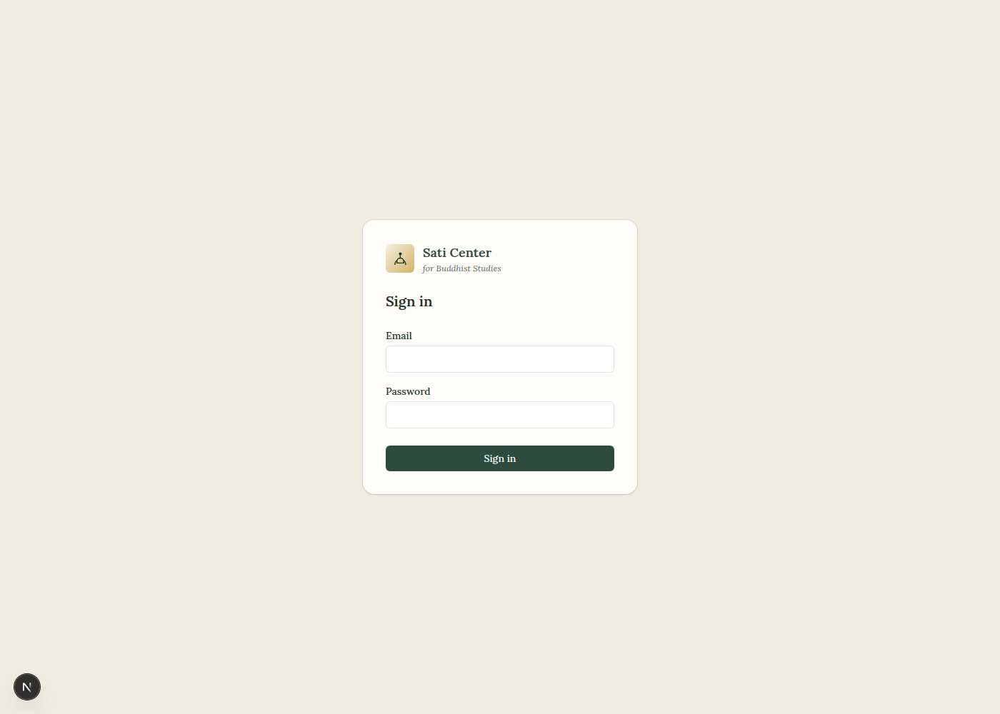
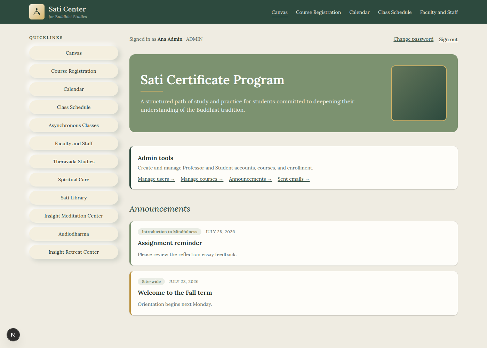
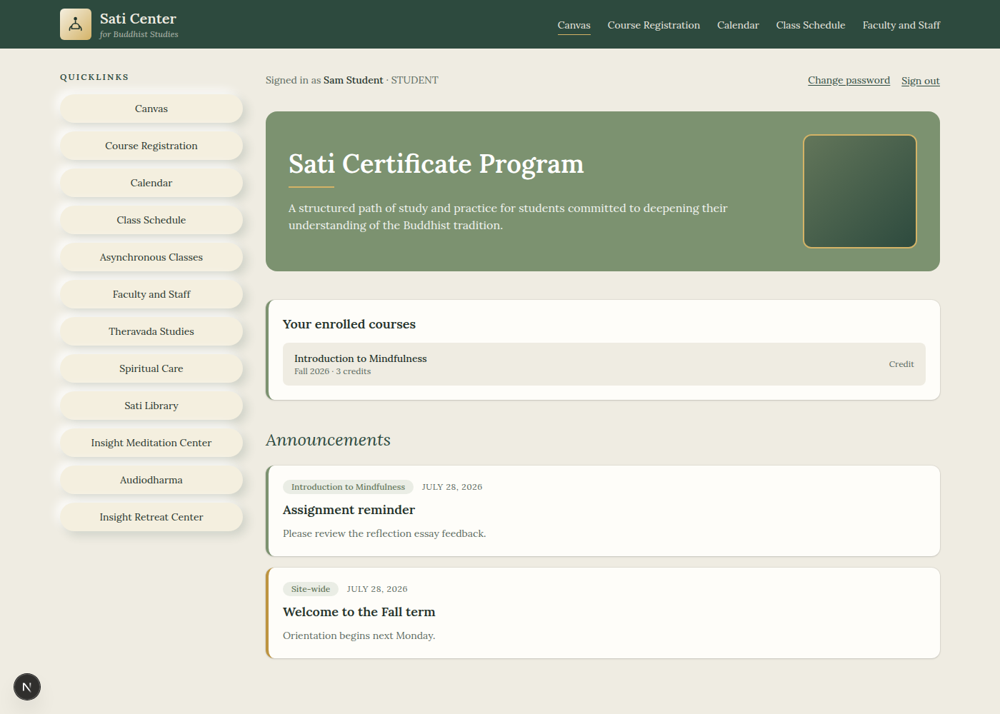
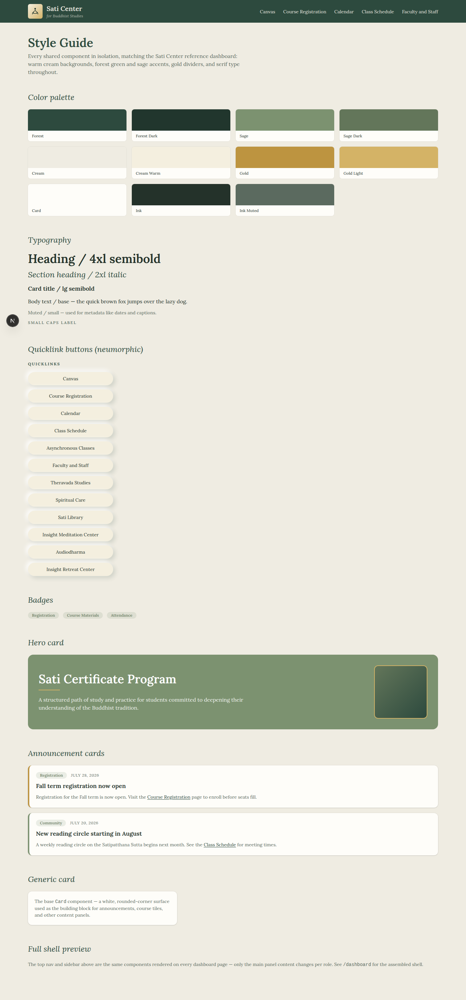

# Sati Center LMS

A self-hosted learning management system for the Sati Center for Buddhist
Studies, modeled on Canvas's core workflows: courses, assignments and
submissions, feedback and grading, attendance and credit tracking, course
materials, and direct email — across Admin, Professor, and Student roles.

This project is being built in stages. See `CLAUDE.md` for the full
stage-by-stage plan, visual design spec, and data model — read that before
picking up new work.

## Screenshots

The app requires a live database, auth, and server-side actions (file
uploads, grading, emails), so it can't run as a static GitHub Pages site —
these screenshots are the viewable-on-GitHub substitute. Run it locally
(see "Local setup" below) to use it for real.

**Sign in**



**Admin dashboard** — role-specific tools



**Student dashboard** — enrolled courses with live credit status



**Design system** (`/style-guide`) — every shared component in isolation



## Stack

- **Framework:** Next.js 16 (App Router) + TypeScript
- **Styling:** Tailwind CSS 4
- **Database:** PostgreSQL via Prisma ORM (pinned to Prisma 6 — see note
  below)
- **Auth:** NextAuth.js v5 (Auth.js) with a Credentials provider, JWT
  sessions, and a `role` field (`ADMIN` | `PROFESSOR` | `STUDENT`) exposed
  on the session. Passwords are hashed with bcrypt.
- **File storage:** local disk to start, abstracted behind a storage
  interface (added in Stage 4) so swapping to S3 is a config change.
- **Email:** abstracted behind an `EmailService` interface (added in Stage
  8); logs to console in dev, sends via Resend when `RESEND_API_KEY` is
  set.

### Why Prisma 6, not 7

Prisma 7 removed `datasource { url = env(...) }` support and requires
wiring a driver adapter (`@prisma/adapter-pg` + `pg`) into every
`PrismaClient` construction. That's a reasonable direction, but it adds a
layer of indirection to every stage of this build for no benefit at our
scale. We're pinned to Prisma 6, which keeps the standard
`new PrismaClient()` + `DATABASE_URL` pattern. Revisit this if/when moving
to serverless/edge Postgres.

## Local setup

1. Install dependencies:

   ```bash
   npm install
   ```

2. Point `DATABASE_URL` at a local Postgres instance. Copy `.env.example`
   to `.env` and adjust if needed:

   ```bash
   cp .env.example .env
   ```

   A `docker-compose.yml` is included for Postgres if you don't already
   have a local server running:

   ```bash
   docker compose up -d
   ```

3. Run migrations and seed the database with one Admin, one Professor, and
   one Student account:

   ```bash
   npm run db:migrate
   npm run db:seed
   ```

   Seeded logins (dev only — change/remove before any real deployment):

   | Role      | Email                     | Password    |
   | --------- | ------------------------- | ----------- |
   | Admin     | admin@saticenter.org      | password123 |
   | Professor | professor@saticenter.org  | password123 |
   | Student   | student@saticenter.org    | password123 |

4. Start the dev server:

   ```bash
   npm run dev
   ```

   Visit http://localhost:3000 — you'll be redirected to `/login`.

## Deploying

Set real values for `DATABASE_URL`, `NEXTAUTH_SECRET` (a long random
string — `openssl rand -base64 32` works), `NEXTAUTH_URL` (your real
origin), and `RESEND_API_KEY`/`EMAIL_FROM` if you want real email
delivery instead of console logging. Then `npm run build && npm run
start`.

`src/lib/auth.ts` sets `trustHost: true` — required for Auth.js v5 outside
Vercel (Vercel sets host trust automatically via its own env detection;
everyone else gets a hard `UntrustedHost` error on every request without
it). This is safe as long as you're not exposing the app directly to
arbitrary inbound Host headers from the internet without a reverse proxy
in front of it — if you are, pin `AUTH_TRUST_HOST`/the `trustHost` option
to your actual origin instead of blanket `true`.

## Scripts

- `npm run dev` — start the dev server
- `npm run build` / `npm run start` — production build/serve
- `npm run lint` — ESLint
- `npm run db:migrate` — run Prisma migrations (dev)
- `npm run db:seed` — re-run the seed script (upserts, safe to re-run)
- `npm run db:studio` — open Prisma Studio to inspect data
- `npm run test:unit` — Vitest unit tests (pure-logic units, e.g. the temp
  password generator)
- `npm run test:e2e` — Playwright end-to-end tests for the critical flows:
  login/RBAC, submission + grading + feedback, attendance logging. Requires
  the dev DB seeded (`npm run db:seed`); spins up `npm run dev` itself if
  nothing is already listening on port 3000.
  Each E2E run provisions its own course/enrollment fixtures with a
  timestamp in the name, so it's safe to run repeatedly against the same
  dev database.
- `npm run test` — both of the above

If Playwright can't find a Chromium binary at the path it expects (common
in sandboxed/CI images that pre-install browsers somewhere nonstandard),
set `PLAYWRIGHT_CHROMIUM_EXECUTABLE_PATH` to the binary's path before
running `npm run test:e2e`; leave it unset to use the browser installed
via `npx playwright install chromium`.

## Decisions made so far (flagged for review)

- **Account creation model:** admin-invited, not public self-registration.
  There is no signup route. Admins create accounts from `/admin/users`,
  which sets a generated temporary password the admin shares with the new
  user out of band (no email infrastructure exists yet — that's Stage 8).
  The new user changes it from `/settings/password` after their first
  login. Chosen because it matches how a small institution like the Sati
  Center actually operates and keeps role assignment (who gets to be a
  Professor/Admin) out of the hands of anonymous visitors. **Open for
  reconsideration** if you'd rather allow student self-registration.
- **Password reset today is admin-mediated, not self-service via email:**
  a locked-out user asks an admin to hit "Reset password" on their row in
  `/admin/users`, which generates a fresh temporary password. A
  self-service "forgot password" email flow needs `EmailService` (Stage 8)
  and is a natural follow-up once that exists.
- **Session strategy:** JWT, not database sessions — required by
  NextAuth's Credentials provider, and keeps auth checks fast in
  `proxy.ts`.
- **Route protection is two-layered:** `src/proxy.ts` (Next.js 16's
  replacement for `middleware.ts`) does a *thin* check — only whether a
  session cookie is present — and redirects to `/login` if not. The real
  security boundary is `requireSession`/`requireRole` from `src/lib/rbac.ts`,
  called at the top of every protected Server Component and Server Action
  (e.g. `/admin/users` calls `requireRole(Role.ADMIN)` both in the page and
  independently in each Server Action, since actions can be invoked
  directly). Non-admins hitting an admin-only route are redirected to
  `/forbidden` (a 307 redirect, not a true HTTP 403 — Next's experimental
  `forbidden()`/`unauthorized()` conventions weren't used to avoid an
  unstable API dependency this early). Data-level RBAC ("students can't see
  each other's submissions") has no data to scope yet — it lands with
  Submission in Stage 5/6, reusing these same helpers.
- **Real content imported from the actual Sati Center reference site**
  (source: the `drmadronelove-prog/Satistudies` repo, a static prototype of
  sati.org's certificate-program dashboard). The real logo
  (`public/brand/sati-logo.png`) replaces the placeholder SVG in
  `src/components/shell/Logo.tsx`. The dashboard hero subtext, and a new
  "Need help?" support-contacts section, were copied verbatim from the
  reference `index.html`. `/schedule` now has a second section with the
  real "2026–27 Theravāda Studies Offerings" (Anukampa Practice Program,
  Deepening Meditation Program, Eightfold Path Program, Theravāda Studies
  Seminar, Sutta Study) linking out to their real registration/info pages,
  kept **separate** from the DB-backed table of courses actually taught
  in this LMS. **Deliberate choice:** those five programs were *not*
  turned into `Course` rows — most are taught by people who aren't
  registered Professors in this system, several run entirely through IMC
  or Zoom outside this app, and modeling them as in-app courses would
  falsely imply this LMS hosts their assignments/attendance/grading.
  `/registration` gained a link to the real external certificate-program
  registration form (Jotform); `/library` is a new page mirroring the
  reference's Sati Library resource list. `Sidebar` quicklinks that don't
  have (and don't need) an in-app page — Asynchronous Classes, Theravada
  Studies, Spiritual Care, Insight Meditation Center, Audiodharma, Insight
  Retreat Center — now point to their real external URLs (new tab) instead
  of 404ing against unbuilt internal routes. The one real announcement in
  the reference site ("Fall Classes Are Open") was **not** seeded directly
  into the database — post it for real via `/admin/announcements`, the
  in-app tool built for exactly this, rather than hardcoding it.
- **Nav trimmed back down, superseding the above and CLAUDE.md's original
  sidebar spec:** per explicit request, the "Canvas" link (top nav +
  sidebar) and every sidebar quicklink unrelated to running courses were
  removed — Asynchronous Classes, Faculty and Staff, Theravada Studies,
  Spiritual Care, Sati Library, Insight Meditation Center, Audiodharma,
  Insight Retreat Center. `/library` was deleted outright rather than left
  as an orphaned route. Sidebar is now just Course Registration, Calendar,
  Class Schedule; top nav keeps those three plus Faculty and Staff (a real
  internal directory, not a dead link). The reasoning given: "this site is
  for managing courses and coursework," not a full campus-portal replica.
- **Assignment grading is Pass/No Pass, not points.** `Assignment.maxPoints`
  and `Submission.grade`'s numeric type were removed in favor of a
  `SubmissionGrade` enum (`PASS` | `NO_PASS`), matching how the real
  certificate program actually grades (units + pass/no-pass, per the
  program's own published curriculum — no point-based grading anywhere in
  the source material). Final course-level grades were already
  CREDIT/NO_CREDIT via `Enrollment.creditStatus` (Stage 7) — same
  pass/no-pass spirit, no schema change needed there. Per-class portals
  (materials, assignments, submissions, feedback, attendance) were already
  generic to any `Course` row as of Stages 4–7, so the 5 real courses
  added to the catalog automatically got full portals with no new code.

## Current status

**Stage 0 (project scaffolding) — done.**

- Next.js + TypeScript + Tailwind + Prisma + Postgres wired up.
- NextAuth Credentials provider with `role` on the session (JWT).
- Seed script creates one Admin, one Professor, one Student.
- `npm run dev` boots; logging in as the seeded admin reaches a protected
  `/dashboard` showing name + role.

**Stage 1 (design system) — done.**

- Shared shell (`AppShell` = `TopNav` + `Sidebar` + main panel) in
  `src/components/shell/`; reusable UI pieces (`Card`, `Badge`,
  `QuickLinkButton`) in `src/components/ui/`; dashboard-specific
  `HeroCard`/`AnnouncementCard` in `src/components/dashboard/`.
- Color tokens (forest green, sage, cream, gold) and neumorphic shadow
  utilities in `src/app/globals.css`; Lora serif font wired in globally.
- `/style-guide` shows every component in isolation; `/login` and
  `/dashboard` are re-themed on top of the same shell.

**Stage 2 (auth & roles) — done.**

- `/admin/users` (Admin-only): list all users, create new accounts (with a
  generated temp password), force-reset any user's password.
- `/settings/password`: any signed-in user changes their own password.
- `/forbidden`: where non-admins land if they hit an admin-only route.
- `/dashboard` now renders a role-specific panel (Admin/Professor/Student)
  alongside the shared hero/announcements.
- `src/lib/rbac.ts` (`requireSession`, `requireRole`) is the real
  authorization boundary, used in every protected page and Server Action.

**Stage 3 (core dashboards & course structure) — done.**

- `/admin/courses` (Admin-only): create courses and assign a professor;
  list all courses with enrollment counts.
- `/admin/courses/[id]`: reassign professor, enroll/unenroll students.
- `/dashboard` shows real, role-scoped course data: Professors see courses
  they teach, Students see courses they're enrolled in (with credit
  status), Admins see links to the admin tools.

**Stage 4 (course materials) — done.**

- `src/lib/storage.ts`: `StorageService` interface, `LocalDiskStorage`
  implementation (writes under `UPLOADS_DIR`; swap for S3 later without
  touching call sites).
- `/professor/courses/[id]` (owner-only): add PDF/link/video materials,
  remove materials.
- `/student/courses/[id]` (enrolled-only): view materials — YouTube URLs
  get an inline embed, everything else links out.
- `/api/files/[...key]`: serves uploaded files, independently checking
  auth + course ownership/enrollment on every request (files live outside
  `public/`, so there's no way to fetch them unauthenticated).

**Stage 5 (assignments & submissions) — done.**

- Professors create assignments and view every submission per assignment
  (`/professor/courses/[id]/assignments/[id]`).
- Students submit a file or text (`/student/courses/[id]/assignments/[id]`);
  resubmitting adds to submission history rather than overwriting it.
  Late is flagged at submit time by comparing to the due date.
- `/api/files` now authorizes submission files separately from course
  materials — only the submitting student, the course's professor, and
  admins can fetch a given submission's file, not the whole class.

**Stage 6 (grading & feedback) — done.**

- One form per submission (professor assignment page) saves a grade
  and/or feedback together, marking the submission `REVIEWED`.
- Feedback is threaded per submission and shown on both the professor's
  and the student's views via a shared `FeedbackThread` component.

**Stage 7 (attendance & course credit) — done.**

- `/professor/courses/[id]/attendance`: take attendance for a chosen
  session date (present/absent/excused per student) and set each
  student's course credit status.
- Student's course page shows their credit status and their own
  attendance history; admin already saw credit status via
  `/admin/courses/[id]`.
- Fixed a same-session UI staleness bug where a saved value (credit
  status, attendance) didn't visually update until a full reload, even
  though the database write was correct — uncontrolled form elements need
  a `key` tied to their value to pick up server-refreshed props.

**Stage 8 (communications) — done.**

> **Later removed:** the site-wide/course announcements feature described
> below (`/admin/announcements`, `/professor/announcements`, the
> `Announcement` model, dashboard/course-page feeds) was deleted by explicit
> request — code, database table, and enum all removed. Direct email is
> unaffected and remains the way admins/professors reach individual
> students.

- `src/lib/email.ts`: `EmailService` interface — console-logs in dev,
  sends via Resend once `RESEND_API_KEY` is set.
- ~~`/admin/announcements` and `/professor/announcements`: post a site-wide
  or course-scoped announcement (professors limited to courses they
  teach). Shown on `/dashboard` (role-scoped feed) and on each course's
  detail page (that course's own announcements).~~
- `/admin/users/[id]/email` and `/professor/students/[id]/email`: compose
  and send an email to one user (professors restricted to their own
  enrolled students). Every send is logged to `DirectEmail`, visible at
  `/admin/emails`.

**Stage 9 (calendar & class schedule) — done.**

- Added `Course.meetingTimes` (free-text) — the schema had nowhere to
  record a recurring meeting time until now; editable from
  `/admin/courses/[id]`.
- `/schedule`: catalog of every course with term, professor, and meeting
  times — open to any authenticated role.
- `/calendar`: role-scoped agenda of assignment due dates and attendance
  sessions, split into Upcoming/Past.

**Stage 10 (hardening & polish) — done.** All 10 stages of the plan are
now built.

- **RBAC audit:** every one of the 17 Server Actions and every protected
  page independently calls `requireRole`/`requireSession` as its first
  statement (defense in depth — `proxy.ts` is a thin redirect, not the
  real boundary). Verified by grepping every `"use server"` file and every
  `page.tsx` under `src/app`.
- **Upload hardening:** submission uploads (previously size-capped only)
  now also reject a blocklist of dangerous extensions
  (`hasDangerousExtension` in `src/lib/storage.ts`) — executables, shell
  scripts, and HTML/SVG that could be rendered/executed if ever served
  directly.
- **Real automated test suite** (previously all verification was ad hoc,
  local Playwright scripts, never committed): `tests/*.spec.ts` covers
  login/RBAC, submission upload → grading → feedback, and attendance
  logging (the announcement-send flow's spec was removed along with the
  feature itself) — plus a small Vitest suite for `generateTempPassword`.
  See "Scripts" above for how to run them.
- **Production-blocking bug found and fixed:** `npm run build && npm run
  start` failed every request with `UntrustedHost` — Auth.js v5 requires
  explicit host trust for self-hosted deployments outside Vercel, and
  nothing had exercised a production build until this stage (every prior
  stage was verified against `next dev`, which trusts the host
  automatically). Fixed with `trustHost: true` in `src/lib/auth.ts`; see
  the comment there for the tradeoff.
- **Closed two real dead ends:** the top nav has linked to `/registration`
  and `/faculty` since Stage 1, but neither route existed (404). Added a
  role-aware `/registration` page and a `/faculty` directory (all
  Admin/Professor accounts) rather than leaving them as placeholder text.
- **Responsive/empty/error states:** added `not-found.tsx`, `error.tsx`,
  and `loading.tsx` at the app root (styled to match the design system,
  not Next's defaults); wrapped every remaining un-scrollable `<table>` in
  `overflow-x-auto`; spot-checked at a 390px mobile viewport against the
  production build.

## Known non-blocking build warning

`npm run build` prints a Turbopack warning about `./src/app/api/files/[...key]/route.ts`
tracing the whole project for its Node file-system tracer (NFT). This only
affects bundle size under `output: "standalone"`, which this project
doesn't use, and is inherent to any route that reads a file path built
from request params. Safe to ignore for now; revisit if standalone/edge
deployment is adopted later.
